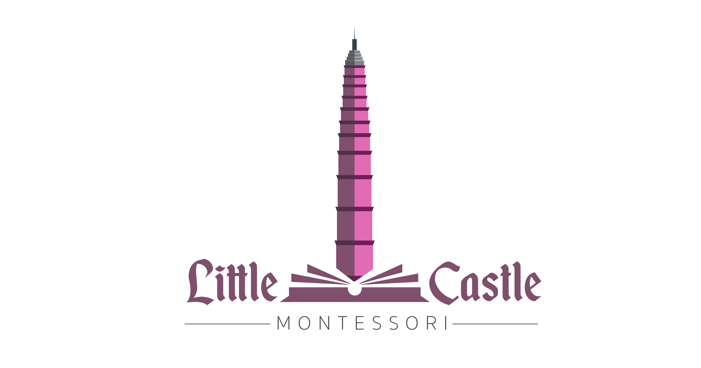

# SAPA Mobile Flutter Monorepo

This monorepo will be bootstrapped using melos. In short, this repositories contains multiple apps that shared the same codebase and reusable components in Flutter. The idea can be generalized for various use cases.

## Getting Started

- Install Flutter, you can follow instruction from [here](https://docs.flutter.dev/get-started/install)

- Clone the repository using SSH. If you haven't done github ssh setup, follow the instructions [here](https://docs.github.com/en/authentication/connecting-to-github-with-ssh/generating-a-new-ssh-key-and-adding-it-to-the-ssh-agent)

```bash
> git@github.com:andifauzy7/sp-mobile-monorepo.git
```


## Setup Melos

If you are not having `melos` setup, heading to: [here](https://pub.dev/packages/melos) for the config,
then you can start bootstrap with:

```bash
> melos bs
```

or

```bash
> melos bootstrap
```

## About



This project is maintained and funded by SAPA School Management & Little Castle.
